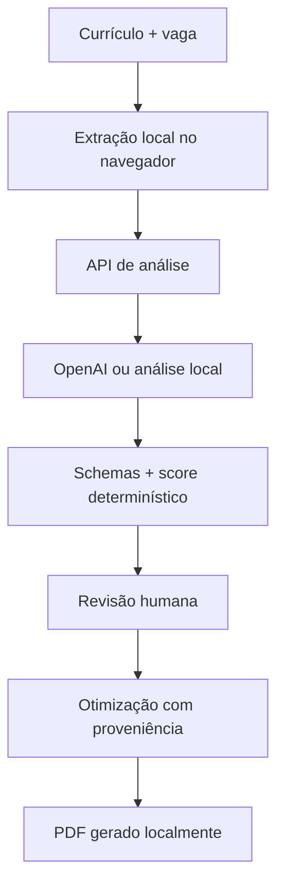

<div align="center">

# Currículo em Foco

### Match your resume to the job — with evidence, not inventions.
### Ajuste seu currículo para cada vaga — com evidências, sem inventar experiências.

Uma aplicação gratuita e sem login que compara currículo e vaga, explica a compatibilidade encontrada e ajuda a gerar uma versão clara, rastreável e amigável para ATS.

A free, loginless application that compares a resume with a job description, explains the evidence behind the match and helps create a clear, traceable and ATS-friendly version.

[](#-status-e-próximos-passos)
[](https://nextjs.org/)
[](https://react.dev/)
[](https://www.typescriptlang.org/)
[](https://developers.openai.com/)
[](https://github.com/yruamkaffer/curriculo-em-foco/actions/workflows/ci.yml)

</div>

---

## 🇧🇷 Sobre o projeto

O **Currículo em Foco** ajuda uma pessoa a entender como seu currículo se relaciona com uma vaga específica antes de se candidatar.

O sistema recebe o currículo em PDF, DOCX, TXT ou texto colado, identifica os requisitos da vaga, procura evidências literais, apresenta lacunas e calcula uma nota de compatibilidade por uma fórmula determinística. Depois, permite criar e revisar uma versão otimizada do currículo sem inventar experiências, competências ou resultados.

Cada sugestão precisa estar ligada ao texto original ou a uma confirmação explícita da pessoa usuária. Antes da exportação, todo o conteúdo pode ser revisado, editado ou restaurado.

O MVP foi criado para ser:

- gratuito para a pessoa usuária;
- utilizável sem cadastro ou login;
- transparente sobre como a compatibilidade é calculada;
- cuidadoso com privacidade e proveniência;
- acessível em diferentes dispositivos e formas de interação;
- conservador: verdade e rastreabilidade valem mais que uma pontuação alta.

> A compatibilidade apresentada é uma estimativa baseada no conteúdo fornecido. Ela não representa chance de contratação nem garante aprovação em processos seletivos.


## 🇺🇸 About the project

**Currículo em Foco** helps people understand how their resume relates to a specific job before applying.

The application accepts PDF, DOCX, TXT or pasted content, identifies job requirements, finds literal evidence, highlights genuine gaps and calculates a deterministic compatibility score. It can then generate a revised resume while preventing unsupported experience, skills or achievements from being introduced.

Every optimized statement must trace back to the original resume or to an explicit user confirmation. The final content remains editable and reviewable before being exported as a selectable-text PDF.

The MVP was designed to be free for end users, loginless, privacy-aware, accessible and transparent about the limits of AI-assisted resume optimization.

---

## ✨ O que o MVP entrega

- Upload de currículo em PDF, DOCX ou TXT;
- alternativa para colar o currículo diretamente como texto;
- extração do conteúdo do arquivo no próprio navegador;
- leitura e classificação dos requisitos da vaga;
- separação entre requisitos obrigatórios, desejáveis e contextuais;
- nota de compatibilidade calculada por fórmula determinística;
- evidências literais vinculadas a cada requisito;
- status confirmado, parcial ou ausente para cada requisito;
- confirmação humana para informações ambíguas;
- identificação transparente de lacunas reais;
- geração de currículo otimizado com rastreabilidade;
- proteção contra invenção de experiências ou competências;
- edição manual antes da exportação;
- restauração do conteúdo sugerido;
- exportação local para PDF com texto selecionável;
- layout simples, linear e amigável para sistemas ATS;
- modo de contingência local quando a API da OpenAI não está configurada;
- interface responsiva e orientada por Design Universal;
- persistência temporária em memória e sessionStorage;
- funcionamento sem conta, autenticação ou banco de dados.

---

## 🧭 Fluxo principal

1. A pessoa importa ou cola seu currículo;
2. cola a descrição da vaga desejada;
3. o sistema extrai e valida os textos;
4. a análise identifica requisitos, evidências e lacunas;
5. a pontuação é recalculada por regras determinísticas;
6. informações ambíguas precisam de confirmação humana;
7. uma versão otimizada é sugerida com proveniência;
8. a pessoa revisa e edita o conteúdo;
9. o currículo final é exportado localmente para PDF.

---

## 🧠 Princípio central da arquitetura

> **A IA sugere. O sistema verifica. A pessoa decide.**

O modelo de linguagem não controla a nota, não grava arquivos e não pode acrescentar informações sem fonte válida.



### Regras de confiança

- O arquivo original é processado no navegador;
- o servidor recebe apenas o texto necessário para a análise;
- entradas da pessoa usuária são tratadas como dados, nunca como instruções para o modelo;
- as respostas da IA precisam respeitar schemas Zod;
- a pontuação retornada pela IA não é considerada confiável e é recalculada;
- evidências e frases otimizadas precisam apontar para fontes válidas;
- IDs de proveniência inexistentes são rejeitados;
- conteúdo ambíguo depende de confirmação humana;
- a exportação acontece somente depois da revisão final.

---

## 📊 Como a compatibilidade é calculada

A pontuação utiliza regras reproduzíveis em vez de pedir que a IA invente um percentual.

| Tipo de requisito | Peso |
|---|---:|
| Obrigatório | 3 |
| Desejável | 1,5 |
| Contextual | 0,5 |

| Correspondência | Fator |
|---|---:|
| Confirmada | 1 |
| Parcial | 0,5 |
| Ausente | 0 |

A aplicação recalcula o resultado no servidor e no cliente. A nota serve como ferramenta de orientação, não como previsão de contratação.

---

## 🛠️ Tecnologias utilizadas

| Área | Tecnologia | Responsabilidade |
|---|---|---|
| Framework | Next.js 16 | App Router, páginas e rotas de API |
| Interface | React 19 | Componentes e experiência de uso |
| Linguagem | TypeScript 5 | Tipagem estática e regras de domínio |
| Design system | shadcn/ui e Radix UI | Componentes reutilizáveis e acessíveis |
| Estilos | Tailwind CSS 4 | Layout responsivo e identidade visual |
| Formulários | React Hook Form | Controle dos campos e estados |
| Validação | Zod 4 | Schemas de entrada, saída e domínio |
| Inteligência artificial | OpenAI Responses API | Análise estruturada e otimização |
| PDF de entrada | PDF.js | Extração de texto de arquivos PDF |
| DOCX | Mammoth | Extração de texto de documentos Word |
| PDF de saída | pdf-lib | Geração local do currículo final |
| Testes unitários | Vitest | Regras de negócio e validações |
| Testes E2E | Playwright | Fluxos completos em desktop e mobile |
| Acessibilidade automatizada | axe-core | Verificações durante os testes E2E |
| Integração contínua | GitHub Actions | Lint, tipos, testes, build e E2E |

---

## ♿ Design Universal e acessibilidade

O projeto foi pensado desde o PRD para reduzir barreiras. A ausência de cadastro faz parte dessa decisão: a pessoa pode utilizar o fluxo principal sem criar conta, confirmar e-mail ou fornecer dados pessoais desnecessários.

Entre as práticas implementadas estão:

- idioma da página definido como português brasileiro;
- skip link para acesso direto ao conteúdo;
- landmarks e estrutura semântica;
- navegação por teclado;
- indicador de foco visível;
- áreas interativas com pelo menos 44 px;
- mensagens de status anunciadas por tecnologias assistivas;
- contraste e informação que não dependem somente de cor;
- reflow em largura de 320 px;
- suporte a preferência de redução de movimento;
- fluxo testado em desktop e dispositivo móvel;
- verificações automatizadas com axe;
- PDF com uma coluna, ordem linear, fonte incorporada e texto selecionável.

O projeto não declara conformidade formal com WCAG ou PDF/UA. Antes de uso institucional, ainda é recomendada uma auditoria manual com pessoas usuárias e tecnologias assistivas.

---

## 🔐 Segurança e privacidade

- Não existe conta ou banco de dados no MVP;
- o arquivo original não é enviado ao servidor;
- o estado permanece em memória e sessionStorage;
- chamadas à OpenAI utilizam `store: false`;
- não existe telemetria própria;
- tipos e tamanhos de arquivo são verificados antes da extração;
- entradas são tratadas como conteúdo não confiável;
- respostas da IA passam por validação estrutural;
- citações e proveniência são verificadas antes da otimização;
- requisições possuem limites de tamanho;
- chamadas às rotas de IA têm rate limit;
- identificadores do rate limit são armazenados como hashes;
- respostas utilizam `Cache-Control: no-store`;
- cabeçalhos bloqueiam framing, MIME sniffing e APIs sensíveis.

> O rate limit atual utiliza memória local e protege somente uma instância. Uma implantação distribuída precisa substituir essa implementação por um armazenamento compartilhado.

---

## 🧪 Qualidade e testes

O projeto possui validação automatizada em diferentes níveis:

- ESLint sem warnings;
- TypeScript em modo estrito;
- testes unitários com Vitest;
- testes completos com Playwright;
- testes nos perfis desktop e mobile;
- auditoria automatizada de acessibilidade com axe;
- build de produção;
- pipeline de CI no GitHub Actions.

Os testes cobrem, entre outros pontos:

- fórmula e pesos da compatibilidade;
- integridade das evidências;
- rejeição de proveniência inválida;
- validação de arquivos;
- extração e ordem de texto em PDF;
- fluxo de confirmação humana;
- geração e download do currículo;
- reflow em tela pequena;
- funcionamento do fluxo principal.

---

## 🧭 Jornada de desenvolvimento e reflexão

Este projeto foi construído como um exercício completo de **vibe coding dentro do ChatGPT e do Codex**, sem utilizar Lovable ou outro construtor visual externo.

O trabalho começou no ChatGPT com a definição do problema, do público-alvo e das premissas do produto. O PRD estabeleceu desde o início que a aplicação deveria ser gratuita, sem barreira de login, orientada por Design Universal e incapaz de inventar informações para melhorar artificialmente um currículo.

O **Codex** foi utilizado diretamente sobre o repositório para transformar o PRD em arquitetura, interface e código. O desenvolvimento foi conduzido em ciclos de implementação, inspeção e validação, com verificações de lint, tipos, testes unitários, testes E2E, acessibilidade e build.

Ao manter todo o fluxo entre ChatGPT e Codex, foi possível trabalhar diretamente com o código-fonte e tornar cada decisão mais rastreável. A experiência também mostrou que vibe coding não precisa significar ausência de engenharia: quanto maior o risco da funcionalidade, mais importantes se tornam regras determinísticas, schemas, testes e confirmação humana.

### Principais aprendizados

- Um PRD claro reduz retrabalho e decisões contraditórias;
- uma pontuação explicável é mais útil que um número inventado pela IA;
- proveniência é essencial ao gerar conteúdo profissional;
- privacidade pode ser simplificada eliminando coleta e persistência desnecessárias;
- ausência de login também é uma decisão de acessibilidade;
- fallback local mantém o produto utilizável sem esconder a indisponibilidade da IA;
- testes automatizados dão segurança para iterar com agentes de programação;
- vibe coding funciona melhor quando a pessoa mantém a direção do produto e valida cada entrega.

### Development reflection

This project was built entirely through a **ChatGPT and Codex vibe-coding workflow**, without Lovable or another external visual builder.

ChatGPT supported product discovery, requirements and the initial PRD. Codex worked directly on the repository to implement, inspect and validate the application. The workflow combined AI-assisted coding with deterministic rules, schemas, provenance checks, accessibility decisions, automated tests and continuous integration.

The main lesson was that vibe coding can still involve solid engineering practices. AI accelerated implementation, while human direction, explicit constraints and automated verification kept the product aligned with its purpose.

---

## 🤖 Autoria e uso de inteligência artificial

**Concepção, decisões de produto, validação e direção do projeto:** [Yruam Käffer](https://github.com/yruamkaffer)

Ferramentas utilizadas:

- **ChatGPT:** ideação, definição do produto, elaboração do PRD e refinamento dos requisitos;
- **Codex:** arquitetura, implementação, revisão, testes, segurança, acessibilidade e acabamento técnico.

A inteligência artificial foi utilizada como ferramenta de desenvolvimento. A definição do problema, as decisões, os critérios de aceitação e a validação das entregas permaneceram sob responsabilidade do autor.

---

## 📁 Estrutura principal

```text
curriculo-em-foco/
├── src/
│   ├── app/                 # Páginas, fluxo principal e rotas de API
│   ├── components/          # Interface, layout e componentes shadcn/ui
│   ├── lib/
│   │   ├── ai/              # Provedor de IA e fallback local
│   │   ├── security/        # Rate limit e proteção de requisições
│   │   └── ...              # Score, arquivos, PDF e regras de domínio
│   └── schemas/             # Contratos Zod
├── e2e/                     # Testes Playwright e axe
├── .github/workflows/       # Pipeline de CI
├── public/                  # Recursos públicos
├── .env.example             # Variáveis documentadas
└── package.json
```

---

## 📸 Prévia

As capturas da versão atual podem ser adicionadas em `docs/screenshots`.

<!--
Depois de adicionar os arquivos, substitua este comentário por:

| Página inicial | Análise de compatibilidade |
|---|---|
|  |  |

| Evidências e lacunas | Currículo otimizado |
|---|---|
|  |  |
-->

Arquivos sugeridos:

```text
docs/screenshots/
├── inicio.png
├── importacao.png
├── analise.png
├── evidencias.png
├── confirmacao.png
├── curriculo-otimizado.png
└── pdf-final.png
```

---

## 🚀 Executando localmente

### Pré-requisitos

- Node.js 20 ou superior;
- npm;
- chave da OpenAI opcional.

Sem uma chave da OpenAI, a aplicação informa que está utilizando o analisador literal local de contingência.

### 1. Clone o repositório

```bash
git clone https://github.com/yruamkaffer/curriculo-em-foco.git
cd curriculo-em-foco
```

### 2. Instale as dependências

```bash
npm install
```

### 3. Configure o ambiente

Linux ou macOS:

```bash
cp .env.example .env.local
```

Windows PowerShell:

```powershell
Copy-Item .env.example .env.local
```

Variáveis disponíveis:

```dotenv
OPENAI_API_KEY=
OPENAI_MODEL=gpt-5.6-luna
RATE_LIMIT_REQUESTS=10
RATE_LIMIT_WINDOW_MS=3600000
```

### 4. Inicie a aplicação

```bash
npm run dev
```

Acesse `http://localhost:3000`.

---

## ✅ Scripts disponíveis

```bash
npm run lint          # ESLint sem warnings
npm run typecheck     # Verificação do TypeScript
npm test              # Testes unitários
npm run test:coverage # Cobertura dos testes unitários
npm run test:e2e      # Playwright + axe
npm run build         # Build de produção
npm run check         # Lint + tipos + unitários + build
```

Na primeira execução dos testes E2E:

```bash
npx playwright install chromium
```

---

## ⚠️ Limites conhecidos do MVP

- Não possui autenticação, histórico permanente ou sincronização entre dispositivos;
- o estado é perdido ao encerrar a sessão do navegador;
- PDFs escaneados não possuem OCR e exigem colagem manual;
- a análise depende da qualidade e do detalhamento dos textos fornecidos;
- o rate limit em memória não é distribuído;
- o PDF não declara conformidade PDF/UA;
- a compatibilidade não representa probabilidade de contratação;
- nenhum formato pode garantir aprovação em filtros ATS;
- a revisão humana continua obrigatória antes do uso do currículo.

<details>
<summary><strong>Aviso sobre dependência transitiva</strong></summary>

O `npm audit` sinaliza uma versão de PostCSS empacotada internamente pelo Next.js. A vulnerabilidade depende da transformação de CSS não confiável em saída; este projeto não aceita nem processa CSS fornecido por usuários, e o PostCSS é utilizado somente durante o build.

Não foi aplicado `npm audit fix --force`, pois isso substituiria a versão atual do Next.js por uma versão incompatível. A dependência deverá ser atualizada quando a correção estiver disponível em uma versão estável e compatível do Next.js.

</details>

---

## 🗺️ Status e próximos passos

O projeto está em estado de **MVP robusto e funcional**.

Evoluções consideradas:

- adicionar OCR para currículos escaneados;
- disponibilizar mais modelos de PDF;
- permitir exportação em DOCX;
- criar comparação entre diferentes vagas;
- oferecer uma explicação ainda mais detalhada da pontuação;
- substituir o rate limit local por armazenamento compartilhado;
- ampliar os testes manuais com leitores de tela;
- executar auditoria formal de acessibilidade e PDF;
- adicionar as capturas da versão final;
- publicar uma demonstração controlada.

---

## 📚 Referências técnicas

- [OpenAI Responses API](https://developers.openai.com/api/docs/guides/migrate-to-responses)
- [OpenAI Structured Outputs](https://developers.openai.com/api/docs/guides/structured-outputs)
- [Controles de dados da OpenAI](https://developers.openai.com/api/docs/guides/your-data)
- [Advisory do PostCSS](https://github.com/advisories/GHSA-qx2v-qp2m-jg93)
- [Discussão do Next.js sobre a dependência empacotada](https://github.com/vercel/next.js/issues/93234)

---

<div align="center">

**Verdade acima da pontuação. Evidências acima de promessas.**

**Truth over scores. Evidence over promises.**

</div>
